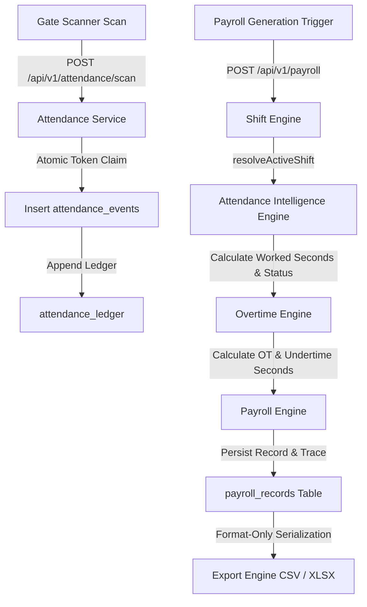
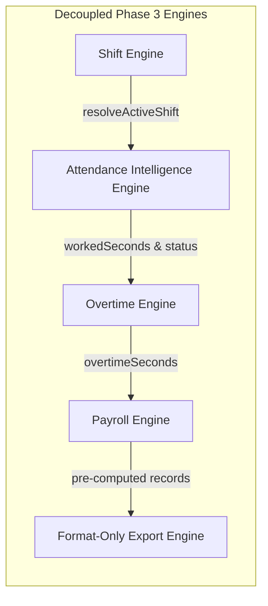
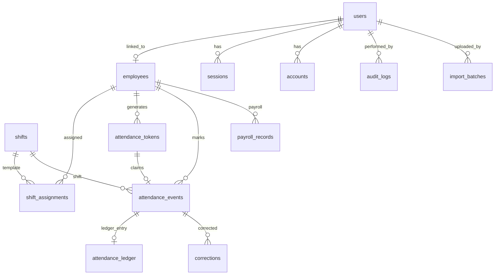
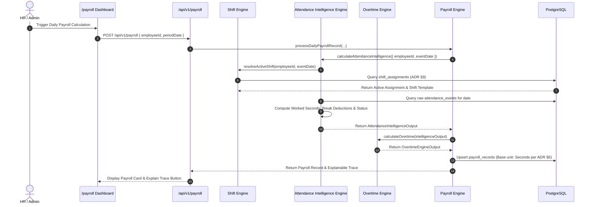

# Enterprise Architecture Blueprint — WorkForce One

**System:** WorkForce One Enterprise Workforce Attendance Management Platform  
**Client Target:** Tamil Nadu Coke and Power Private Limited (~15,000 Employees)  
**Version:** v0.3.0 — Production Baseline  
**Date:** July 2026  

---

## 1. System Overview & Architecture Philosophy

WorkForce One is a high-throughput, security-critical enterprise workforce attendance management system designed for industrial manufacturing facilities.

### Core Philosophy
1. **Server Authority (Zero Client Trust)**: All business decisions, timestamps, token claims, shift rule evaluations, and authorization checks are computed exclusively on the server. Device clocks and client state are strictly untrusted.
2. **Atomic Token Claiming**: Anti-replay QR token consumption uses atomic PostgreSQL `UPDATE...RETURNING` queries to eliminate Time-of-Check to Time-of-Use (TOCTOU) race conditions under heavy gate load.
3. **Single Source of Truth Attendance Intelligence**: All status and worked time computations are isolated exclusively within `src/lib/intelligence/`. No API routes, UI components, or Export engines re-interpret attendance rules.
4. **Immutability & Auditability**: Historical attendance records (`attendance_ledger`) and system audit logs (`audit_logs`) are strictly append-only. No `UPDATE` or `DELETE` operations are permitted on audit or ledger history.
5. **Single-Node VPS Economy**: Built to handle ~15,000 employees × 2 events/day (~30,000 attendance events/day) within a budget of ₹1,800–2,600/month on a single self-hosted VPS (ADR §1).

---

## 2. High-Level System Architecture Diagram

```mermaid
graph TD
    Client[Browser / Mobile PWA / Gate Scanner] -->|HTTPS / REST API| NextJS[Next.js 14 App Router]
    
    subgraph Application Server (VPS)
        NextJS --> Middleware[Next.js Middleware Guard]
        Middleware --> AuthLayer[NextAuth v5 & Credentials Provider]
        Middleware --> APIRoutes[API v1 Route Handlers]
        
        APIRoutes --> RBAC[RBAC Guard Matrix]
        RBAC --> Services[Domain Services Layer]
        
        subgraph Domain Services Layer
            Services --> ShiftEngine[Shift Engine]
            Services --> IntelligenceEngine[Attendance Intelligence Engine]
            Services --> OvertimeEngine[Overtime Engine]
            Services --> PayrollEngine[Payroll Engine]
            Services --> ExportEngine[Export Engine]
            Services --> TokenEngine[QR Token Engine]
            Services --> AuditLogger[Extended Audit Logger]
        end
        
        Services --> ORM[Drizzle ORM Layer]
    end
    
    subgraph Database Server (Self-Hosted PostgreSQL)
        ORM --> Postgres[(PostgreSQL 16 DB)]
        
        subgraph Data Storage
            Postgres --> CoreTables[Users / Employees / Shifts / Shift Assignments]
            Postgres --> QRTables[Attendance Tokens / Events]
            Postgres --> LedgerTables[Attendance Ledger - Immutable]
            Postgres --> PayrollTables[Payroll Records - Time-Based]
            Postgres --> AuditTables[Audit Logs - Immutable]
        end
    end
```

---

## 3. End-to-End Attendance & Payroll Flow Diagram



---

## 4. 5-Domain Engine Architecture (Phase 3)



---

## 5. Database Entity-Relationship (ER) Diagram



---

## 6. Sequence Diagrams

### Sequence 1: Attendance Intelligence & Payroll Calculation



---

## 7. Security Architecture Summary

- **Authentication**: NextAuth Credentials Provider using bcryptjs password hashing (12 salt rounds).
- **Session Strategy**: Database & JWT session management (`SESSION_TIMEOUT_MINUTES=30`).
- **Anti-Replay Defense**: Single-use atomic token claim (`UPDATE...RETURNING`).
- **Single Active Token**: Refreshing QR invalidates previous unconsumed active tokens.
- **Audit Policy**: Immutable append-only audit trail logging all `AUTH`, `EMPLOYEE`, `SHIFT`, `PAYROLL`, `ATTENDANCE`, and `SYSTEM` events.

---

## 8. Scalability & Deployment Architecture

- **Current Scalability**: Scaled for ~15,000 employees × 2 events/day on a single 4-core, 8GB RAM VPS.
- **Database Indexes**: Composite indices on `(employee_id, event_date)`, `(employee_id, is_consumed, expires_at)`, and unique composite index on `(employee_id, event_type, event_date)`.
